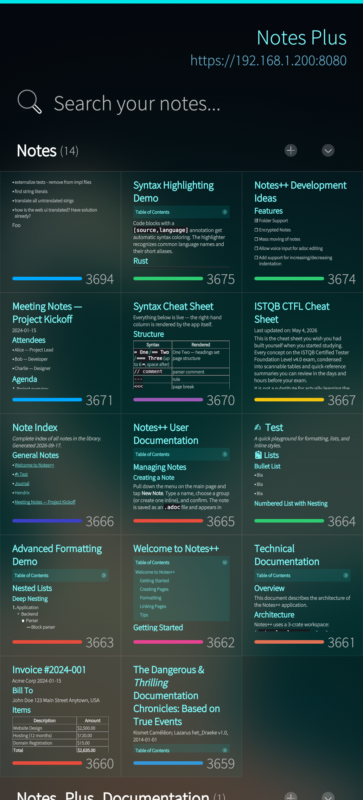
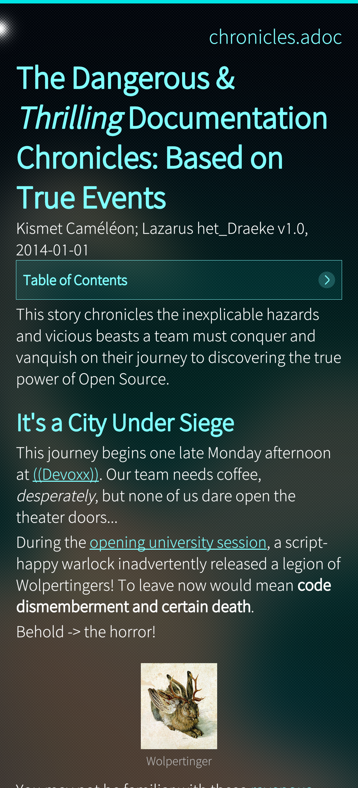
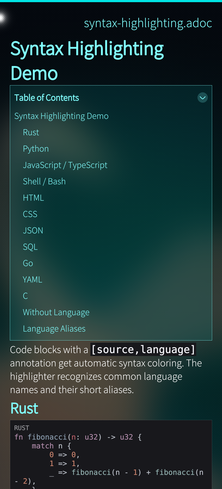
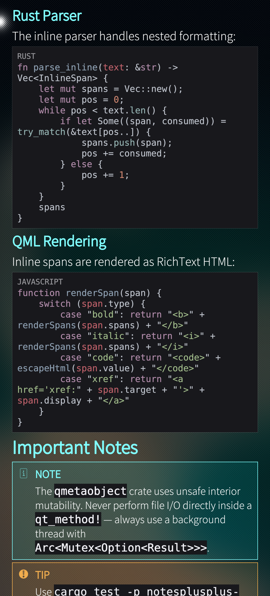
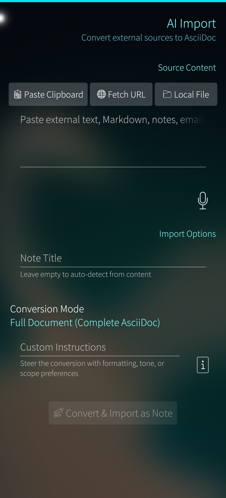
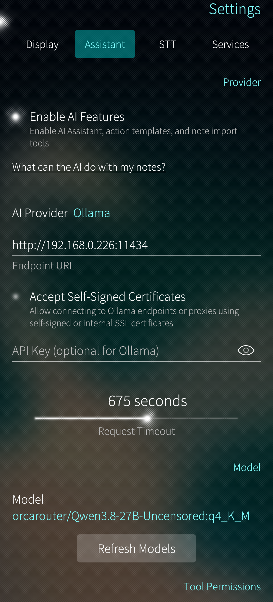

# Notes Plus

A fast, offline-first AsciiDoc notes app for **Sailfish OS** with an AI assistant, speech-to-text, and a built-in web editor accessible from any browser on your network.

## Why Notes Plus?

I've been a Sailfish OS user for over a decade — starting with the first Jolla phone, and before that an N900. At work I build AI tools and work with AI daily, so I got used to having it around. I also got used to Jolla Notes: its simplicity is exactly what I want from a notes app. But I often wished for just a bit more — AsciiDoc formatting, full-text search, a way to get my notes onto a bigger screen.

Notes Plus is that "tad more." Underneath, the data model is as simple as it gets: plain text files on disk. Everything on top — web editor, groups, AI assistant, text-to-speech — is optional and can be turned off. If all you want to do is write formatted notes without any of that, no problem. Disable the features and they won't distract you. It works completely offline and does not send your data anywhere unless you explicitly connect it to an AI provider by entering its address in the settings.

## Data Privacy

Notes Plus is designed for data sovereignty. Your notes never leave your device unless you choose to sync them yourself.

- **No cloud services, no telemetry, no phone-home.** The app has no integrations with any external cloud system or analytics service.
- **Local AI support.** You can point it at any OpenAI-compatible API, but nothing is configured by default.
- **Web server is off by default.** The embedded HTTPS server must be explicitly enabled in Settings.
- **HTTPS-only.** The server only accepts TLS connections (auto-generated self-signed certificates or your own). No cleartext HTTP.
- **Configurable network binding.** Choose which interface to bind to — localhost only, a specific LAN or Bluetooth interface, or all interfaces.
- **Public IP rejection.** Enabled by default — connections from routable Internet addresses are refused at the socket level, regardless of firewall rules.
- **Phone-gated authentication.** Every web UI session requires a verification code challenge (cryptographically random, generated via `ring`) that must be approved or denied on the phone itself. Only the phone's UI can grant access — approval is not possible over the network. Sessions are `HttpOnly`, `Secure`, `SameSite=Lax` cookies with configurable expiry.
- **AI permission system.** The AI assistant's tool access is granular (read, create, edit, fetch_url). Edit operations show a diff preview and require confirmation. Automatic backup snapshots before any AI modification enable one-tap rollback.
- **Offline speech-to-text.** The Whisper-based STT engine runs entirely on-device with checksum-verified model downloads — no audio data is sent anywhere.
- **Plain text on disk.** Notes are `.adoc` files in a folder. No database lock-in, no proprietary format. Sync with Syncthing, Nextcloud, Git, or USB — your choice.

## Why AsciiDoc?

AsciiDoc is not harder to write than Markdown, and it's far superior — because it has a specification. It has native tables with column widths and cell spans, admonitions (`NOTE:`, `TIP:`, `WARNING:`), typed delimited blocks for code, quotes, and sidebars, cross-references between documents, and document attributes for metadata. No plugins, no non-standard extensions, no "which flavor of Markdown are we talking about?" — just a spec that means the same thing everywhere.

Your notes are stored as plain `.adoc` files on the filesystem. No database, no proprietary format, no cloud lock-in. Sync them with Syncthing, Nextcloud, Git, or just copy them over USB. Every text editor can open them, and because AsciiDoc has a spec, the goal is that any other AsciiDoc renderer can pick them up and render them as-is.

## Features

- **AsciiDoc Notes** — Full parser with headings, lists, tables, code blocks, admonitions, cross-references, and image support
- **AI Assistant** — Chat with an LLM (Ollama or OpenAI-compatible) to edit, summarize, beautify, and create notes with tool-calling and diff previews
- **Import Assistant** — Convert external text, URLs, clipboard, or files into structured AsciiDoc notes via AI
- **Speech-to-Text** — Offline Whisper-based voice input for dictating prompts and notes directly on device
- **Web Editor** — Embedded HTTPS server with a Vue 3 split-pane editor, live preview, and full AI assistant access from any browser
- **Full-Text Search** — Instant SQLite FTS5 search across all notes
- **Journal** — Daily notes with checkbox task lists
- **Authentication** — Verification code challenge with approve/deny on the phone for secure remote access

## Screenshots

| | | |
|---|---|---|
|  |  |  |
|  |  |  |

More screenshots: [docs/screenshots/](docs/screenshots/)

## Installation

### Sailfish OS

1. Download the latest `.rpm` from the Releases page
2. Transfer to your phone and tap to install (or use `devel-su pkcon install harbour-notesplus.rpm`)
3. Launch **Notes Plus** from the app grid

### Web UI

1. Enable the web server in **Settings > Services > Server Active**
2. Open the displayed URL (e.g. `http://192.168.1.100:8080`) from any browser on the same network
3. Authenticate if required (configured in Settings > Services)

## Building from Source

### Prerequisites

- [Sailfish OS SDK](https://docs.sailfishos.org/Tools/Sailfish_SDK/) with Docker engine
- `sfdk` in PATH
- Build target: `SailfishOS-5.1.0.11-aarch64` (default), `SailfishOS-5.1.0.11-armv7hl`, or `SailfishOS-5.1.0.11-i486` (configurable via `SAILFISH_TARGET` env var)

### Build

```bash
./build-sailfish.sh

# armv7hl (Xperia XA2, Xperia 10, community ports):
SAILFISH_TARGET=SailfishOS-5.1.0.11-armv7hl ./build-sailfish.sh

# i486 (emulator):
SAILFISH_TARGET=SailfishOS-5.1.0.11-i486 ./build-sailfish.sh
```

### Deploy to Phone

```bash
./deploy-sailfish.sh
```

### Run Tests (Host)

```bash
cargo test -p notesplus-core
```

See [DEVELOPMENT.md](DEVELOPMENT.md) for detailed architecture, testing, and CI documentation.

## Project Structure

```
├── notesplus-core/          # Pure Rust core engine
│   ├── src/
│   │   ├── parser/              # AsciiDoc AST parser
│   │   ├── agent/               # LLM client + tool-calling agent
│   │   ├── stt/                 # Whisper STT engine + model downloader
│   │   ├── server/              # Embedded HTTP/HTTPS server + auth
│   │   ├── db.rs                # SQLite + FTS5
│   │   └── page.rs              # Page indexing & management
│   └── assets/web/              # Vue 3 web UI (static files)
├── notesplus-sailfish/      # Sailfish OS GUI application
│   ├── src/bridge/              # Rust ↔ QML bridge objects
│   └── qml/                     # Sailfish Silica QML pages
├── build-sailfish.sh            # Cross-compile for Sailfish OS
└── deploy-sailfish.sh           # Deploy RPM to phone via SSH
```

## License

Notes Plus is open source software released under the [MIT License](LICENSE).

## Acknowledgements & Attributions

Notes Plus is inspired by and builds upon the work of several open source projects:

- **Jolla Notes** — The clean simplicity, tactile card interface, and color accents are inspired by the original Sailfish OS Notes application by Jolla Ltd.
- **SpeechNote** — The offline, privacy-first speech-to-text architecture and model management are inspired by SpeechNote by [Michal Kowalczyk (mkiol)](https://github.com/mkiol/speechnote).
- **whisper.cpp & ggml** — High-performance C/C++ inference for OpenAI's Whisper model by [Georgi Gerganov](https://github.com/ggerganov/whisper.cpp) (MIT License).
- **Vue.js 3 & Pinia** — Reactive web frontend framework and store management for the embedded web companion by [Evan You](https://vuejs.org/) and contributors (MIT License).
- **svgbob** — ASCII diagram to SVG converter in Rust by [ivanceras](https://github.com/ivanceras/svgbob) (Apache-2.0 / MIT License).
- **syntect** — Syntax highlighting library for code blocks using Sublime Text syntaxes by [Tristan Hume](https://github.com/trishume/syntect) (MIT License).
- **SQLite & rusqlite** — Embedded relational database and FTS5 full-text search engine (Public Domain) with ergonomic Rust bindings by [John Gallagher](https://github.com/rusqlite/rusqlite) and contributors (MIT License).
- **rustls & ring** — Memory-safe modern TLS library and cryptography engine by [Brian Smith](https://github.com/briansmith/ring) and [Rustls contributors](https://github.com/rustls/rustls) (Apache-2.0 / ISC / MIT License).
- **tiny_http** — Zero-dependency embedded HTTP server by [Corentin Henry](https://github.com/tiny-http/tiny-http) and contributors (Apache-2.0 / MIT License).
- **ureq** — Minimalist, safe HTTP client for Rust by [Martin Algesten](https://github.com/algesten/ureq) and contributors (Apache-2.0 / MIT License).
