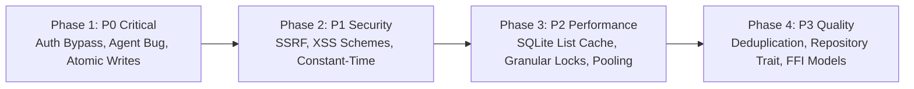

# Notes++ Quality & Security Remediation Plan

This remediation plan establishes a prioritized, actionable backlog to address the security vulnerabilities, architectural bottlenecks, code duplications, and robustness issues identified in the **Notes++** codebase (`notesplusplus-core` and `notesplusplus-sailfish`).

The work is organized to maximize net positive impact (utility): resolving the highest-risk threats to user data and device integrity first, followed by high-return stability fixes, performance optimizations, and maintainability enhancements.

---

## Prioritization & Utility Impact Matrix

| Phase | Priority | Focus Area | Net Value / Risk Reduction | Est. Effort |
| :--- | :--- | :--- | :--- | :--- |
| **Phase 1** | **P0 (Critical)** | Core Security & Data Loss Prevention | Eliminates remote unauthorized access and prevents data file truncation | Low–Medium |
| **Phase 2** | **P1 (High)** | Network & Parser Hardening | Mitigates SSRF, Stored XSS, and timing side-channels | Low–Medium |
| **Phase 3** | **P2 (Medium)** | Performance, I/O & Concurrency | Reduces battery drain, file I/O latency, and UI/server thread stalls | Medium |
| **Phase 4** | **P3 (Quality)** | Architecture, Deduplication & FFI | Improves developer velocity, testability, and UI responsiveness | Medium–High |

---

## Phase 1: Critical Security & Data Loss Prevention (P0)

### 1.1 Restrict Authentication Challenge Approval to Direct In-Process UI Calls (Resolved)

- **Target Files:**
  - `notesplusplus-core/src/server/routes/auth.rs` (removed `handle_challenge_approve` and `handle_challenge_deny`)
  - `notesplusplus-core/src/server/routes/mod.rs` (removed `/api/auth/code/approve` and `/api/auth/code/deny` routes)
  - `notesplusplus-sailfish/src/bridge/pages.rs` (`approve_auth_challenge` direct native call)
- **Problem & Impact:**
  The challenge approval endpoint (`/api/auth/code/approve`) was previously reachable over the local Wi-Fi/LAN without authentication. Any LAN client could initiate a challenge and approve it directly via HTTP without local device interaction, obtaining a valid bearer token.
- **Remediation:**
  1. Removed the `/api/auth/code/approve` and `/api/auth/code/deny` HTTP endpoints entirely from the server router and handler modules.
  2. Enforced that challenge approval/denial occurs strictly in-process via direct native calls (`bridge.approve_auth_challenge()`) triggered by physical user interaction on the device UI (`AuthPrompt.qml`).
  3. Eliminated network attack surface for challenge authorization bypass.
- **Verification:**
  - Integration test `test_challenge_approve_endpoint_not_exposed_over_http` confirms HTTP approval attempts return 404 and in-process approval succeeds.

---

### 1.2 Fix Agent Tool Filename Sanitization Bug (Resolved)

- **Target Files:**
  - `notesplusplus-core/src/agent/session.rs` (`execute_tool`, `apply_note_edit`, `rollback_snapshot`)
  - `notesplusplus-core/src/page.rs` (`sanitize_note_filename`, `safe_note_path`)
- **Problem & Impact:**
  In `AgentSession::execute_tool`, handling of `read_note` and `edit_note` ran `page::sanitize_filename(filename)`. Since `sanitize_filename` replaced `.` with `_`, `notes.adoc` became `notes_adoc`, resulting in "File not found" errors or creating corrupted extensionless files.
- **Remediation:**
  1. Implemented `sanitize_note_filename` and `safe_note_path` in `page.rs`, properly preserving `.adoc` extensions while replacing path traversal and unsafe characters.
  2. Updated `execute_tool`, `apply_note_edit`, and snapshot rollbacks in `session.rs` to use safe path resolution and note filename sanitization.
  3. Enforced strict path containment within `notes_dir`.
- **Verification:**
  - Added unit tests `test_sanitize_note_filename`, `test_safe_note_path`, and `test_read_and_edit_note_with_adoc_extension` confirming `.adoc` extensions are preserved and file operations succeed.

---

### 1.3 Implement Atomic File Write Strategy (Resolved)

- **Target Files:**
  - `notesplusplus-core/src/server/routes/pages.rs` (`handle_page_detail_api`, `handle_notes_api`)
  - `notesplusplus-core/src/agent/session.rs` (`create_note`, `apply_note_edit`, `rollback_snapshot`)
  - `notesplusplus-core/src/page.rs` (`atomic_write`, `create_page`)
- **Problem & Impact:**
  Direct calls to `std::fs::write(&file_path, &content)` risked file truncation or corruption if the device powered off, battery died, or the process crashed during write operations.
- **Remediation:**
  1. Implemented `page::atomic_write(path: &Path, content: impl AsRef<[u8]>) -> std::io::Result<()>` using a hidden temporary sibling file (`.filename.tmp.<nonce>`), flushing data and metadata to disk with `sync_all()`, and atomically renaming to the destination path.
  2. Replaced all direct `std::fs::write` calls for note content across `page.rs`, `server/routes/pages.rs`, and `agent/session.rs` with `atomic_write`.
- **Verification:**
  - Unit test `test_atomic_write` verifies atomic creation, atomic overwriting, and data integrity.

---

## Phase 2: Network & Parser Security Hardening (P1)

### 2.1 Robust IP-Based SSRF Mitigation & Redirect Hardening (Resolved)

- **Target Files:**
  - `notesplusplus-core/src/agent/tools.rs` (`is_blocked_ip`, `parse_direct_ip`, `parse_target_host_port`, `is_blocked_host`, `fetch_url`)
  - `notesplusplus-core/src/agent/session.rs` (`execute_tool` -> `fetch_url`)
- **Problem & Impact:**
  SSRF filtering previously matched simple substrings (e.g. `"10."`, `"localhost"`), causing false positives on legitimate public domains (`top10.com`) and failing against alternative IP encodings (decimal, hex, octal), DNS rebinding, IPv6 ULA, and 3xx HTTP redirects.
- **Remediation:**
  1. Implemented `is_blocked_ip` covering all loopback, private, link-local, carrier-grade NAT, test/documentation, and reserved IPv4 and IPv6 CIDRs.
  2. Implemented `parse_direct_ip` to identify alternative decimal, hexadecimal, octal, and dotted formats.
  3. Implemented DNS pre-resolution and configured `fetch_url` with manual redirect loop (`redirects(0)`) to re-validate destination IPs on every redirect hop.
- **Verification:**
  - Unit tests covering `localhost`, `10.0.0.1`, `192.168.1.100`, `172.16.0.1`, `169.254.169.254`, decimal `2130706433`, hex `0x7f000001`, `[::1]`, `[fd00::1]`, and verifying no false positives on public hosts.

---

### 2.2 Whitelist URL Schemes in HTML Link Rendering (Stored XSS) (Resolved)

- **Target Files:**
  - `notesplusplus-core/src/html.rs` (`render_spans` -> `InlineSpan::Link`, `sanitize_url_scheme`)
- **Problem & Impact:**
  AsciiDoc links formatted as `link:javascript:alert(1)[Click]` rendered directly into `<a href="javascript:alert(1)">`, permitting arbitrary JavaScript execution when notes were previewed or exported to HTML.
- **Remediation:**
  1. Implemented `sanitize_url_scheme` in `html.rs` whitelisting safe schemes (`http`, `https`, `mailto`, `tel`, `ftp`, `ftps`, `geo`, `sms`, and relative/fragment URLs).
  2. Neutralized disallowed or dangerous schemes (`javascript:`, `vbscript:`, `data:`) by prepending `#blocked:`.
- **Verification:**
  - Unit test `test_sanitize_url_scheme` verifies malicious URLs are safely neutralized while legitimate links render correctly.

---

### 2.3 Constant-Time Comparison for Bearer Token Verification (Resolved)

- **Target Files:**
  - `notesplusplus-core/src/server/routes/mod.rs` (`is_authorized`)
  - `notesplusplus-core/src/server/auth.rs` (`constant_time_eq`, `SessionStore::validate_session`)
- **Problem & Impact:**
  Standard `==` string equality leaked timing information proportional to the number of matching prefix bytes, facilitating side-channel attacks on secret bearer tokens over low-latency networks.
- **Remediation:**
  1. Implemented constant-time string comparison function `constant_time_eq` in `notesplusplus-core/src/server/auth.rs`.
  2. Applied `constant_time_eq` across bearer token extraction in `is_authorized` and active session lookup in `SessionStore::validate_session`.
- **Verification:**
  - Unit test `test_constant_time_eq` verifies comparison correctness on matching and non-matching secrets of varying lengths.

---

### 2.4 Consolidate Fragmented Title & Slugification Helpers (Resolved)

- **Target Files:**
  - `notesplusplus-core/src/page.rs` (`extract_doc_title`, `sanitize_note_filename`, `safe_note_path`)
  - `notesplusplus-core/src/server/routes/pages.rs` (`extract_title_from_adoc`, `make_slug_filename`)
  - `notesplusplus-core/src/agent/session.rs`
- **Problem & Impact:**
  Title extraction and filename sanitization were implemented across multiple modules with diverging edge-case behavior.
- **Remediation:**
  1. Consolidated title extraction into `page::extract_doc_title` in `notesplusplus-core/src/page.rs`, parsing document headers with graceful fallback to file stems.
  2. Consolidated note filename sanitization and safe path resolution into `page::sanitize_note_filename` and `page::safe_note_path`.
  3. Re-used canonical helpers across `page.rs`, `server/routes/pages.rs`, and `agent/session.rs`.
- **Verification:**
  - Unit tests verify title extraction, filename sanitization, and path traversal rejection across the test suite.

---

### 2.5 Replace Redundant Filesystem Scans with SQLite Index Queries (Resolved)

- **Target Files:**
  - `notesplusplus-core/src/server/routes/pages.rs` (`list_all_notes_json_with_db`, `handle_notes_api`)
- **Problem & Impact:**
  `list_all_notes_json` performed a full directory traversal and disk read of every `.adoc` file upon every request to construct note titles and preview snippets, bypassing the SQLite database cache.
- **Remediation:**
  1. Implemented `list_all_notes_json_with_db` to query SQLite `pages` and `pages_fts` tables directly when the database is available.
  2. Maintained filesystem traversal only as a fallback when database path is not provided.
- **Verification:**
  - Integration tests in `server/mod.rs` verify fast and accurate note listing and search via SQLite index.

---

## Phase 3: Performance, I/O & Concurrency (P2)

### 3.1 Replace Filesystem Scans with SQLite Index Queries

- **Target Files:**
  - `notesplusplus-core/src/server/routes/pages.rs` (`list_all_notes_json`)
  - `notesplusplus-core/src/db.rs`
- **Problem & Impact:**
  `list_all_notes_json` performs a full directory traversal and disk read of every `.adoc` file upon every request to construct note titles and preview snippets, bypassing the SQLite database cache.
- **Remediation Steps:**
  1. Update `list_all_notes_json` to query `SELECT id, title, path, updated_at FROM pages` directly from SQLite.
  2. Ensure page creation, edit, and delete handlers update the SQLite `pages` table transactionally.
  3. Keep filesystem scans solely as a background reconciliation/sync fallback on application boot.
- **Verification:**
  - Benchmark listing endpoint with 500+ notes; verify zero file I/O during standard list requests.

---

### 3.2 Granular Mutex Strategy for LLM Agent State

- **Target Files:**
  - `notesplusplus-core/src/server/mod.rs` (`ServerContext`)
  - `notesplusplus-core/src/agent/session.rs`
- **Problem & Impact:**
  The LLM agent session (`ctx.session: Arc<Mutex<AgentSession>>`) is locked for the entire duration of streaming LLM network requests, blocking health checks, status queries, and concurrent read requests.
- **Remediation Steps:**
  1. Separate active turn execution state from metadata/configuration.
  2. Use channel-based communication or an asynchronous/state-machine approach where the lock is released while waiting on external network I/O from LLM endpoints.
  3. Allow read-only status inspection (`is_busy`, pending tool calls) without acquiring an exclusive long-held execution lock.
- **Verification:**
  - Test issuing a status request while an LLM streaming query is active; verify response returns immediately.

---

### 3.3 Database Connection Pooling / Shared Connections

- **Target Files:**
  - `notesplusplus-core/src/server/mod.rs`
  - `notesplusplus-core/src/db.rs`
- **Problem & Impact:**
  A new SQLite database connection (`Connection::open(&ctx.db_path)`) is opened and closed for each incoming HTTP request, incurring redundant disk and file-descriptor overhead.
- **Remediation Steps:**
  1. Provide a managed SQLite connection pool (`r2d2_sqlite`) or an `Arc<Mutex<Connection>>` with WAL (Write-Ahead Logging) mode enabled.
  2. Configure SQLite `PRAGMA journal_mode=WAL;` and `PRAGMA synchronous=NORMAL;` for optimal concurrency and read performance on embedded flash storage.
- **Verification:**
  - Verify concurrent read and write operations under multi-threaded test conditions.

---

## Phase 4: Code Quality, Deduplication & Architecture (P3)

### 4.1 Consolidate Fragmented Title & Slugification Helpers

- **Target Files:**
  - `notesplusplus-core/src/page.rs`
  - `notesplusplus-core/src/server/routes/pages.rs`
  - `notesplusplus-core/src/agent/session.rs`
  - `notesplusplus-core/src/agent/tools.rs`
- **Problem & Impact:**
  Title extraction (`extract_title`, `extract_title_from_adoc`, `extract_doc_title`) and filename slugification are implemented across multiple modules with diverging edge-case behavior.
- **Remediation Steps:**
  1. Consolidate title extraction into a single canonical function in `notesplusplus-core/src/page.rs`:
     - Checks AsciiDoc header `= Document Title`
     - Falls back to first section heading `== Heading`
     - Falls back to first non-empty line or file stem
  2. Consolidate slugification and extension normalization in `page.rs` and re-export across server and agent modules.
  3. Remove duplicated implementations in `routes/pages.rs` and `agent/session.rs`.
- **Verification:**
  - Comprehensive unit test suite covering title extraction edge cases (empty files, attributes, comments, Unicode).

---

### 4.2 Decouple Route Handlers via Repository Layer

- **Target Files:**
  - `notesplusplus-core/src/server/routes/`
  - `notesplusplus-core/src/page.rs`
- **Problem & Impact:**
  HTTP route handlers currently intertwine raw HTTP parsing, database access, filesystem I/O, error formatting, and JSON generation, hindering automated testing without HTTP fixtures.
- **Remediation Steps:**
  1. Define a `NoteRepository` trait defining core operations: `list()`, `get(id)`, `create(note)`, `update(id, content)`, `delete(id)`.
  2. Implement `FsSqliteNoteRepository` implementing the trait.
  3. Refactor route handlers to operate purely as thin presentation adapters over `NoteRepository`.
- **Verification:**
  - Unit tests for repository logic isolated from HTTP transport.

---

### 4.3 Modernize Qt Quick / Rust FFI Data Transfer

- **Target Files:**
  - `notesplusplus-sailfish/src/ffi.rs`
  - `notesplusplus-sailfish/src/bridge/`
  - `notesplusplus-sailfish/qml/`
- **Problem & Impact:**
  Passing whole note lists and search result sets as serialized JSON strings over FFI forces QML to parse large JSON trees in JavaScript, degrading UI rendering frame rates and increasing GC pressure on mobile hardware.
- **Remediation Steps:**
  1. Implement a `QAbstractListModel` binding or structured `QVariantList` objects for search results and page catalogs.
  2. Expose incremental updates (insert, update, remove signals) rather than full list invalidations.
  3. Move intensive parsing and indexing off the main Qt UI thread onto background worker threads.
- **Verification:**
  - Validate smooth 60fps scrolling on Sailfish OS device with >1000 notes loaded.

---

### 4.4 Embedded HTTP Server Hardening

- **Target Files:**
  - `notesplusplus-core/src/server/http.rs`
  - `notesplusplus-core/src/server/mod.rs`
- **Problem & Impact:**
  The custom HTTP/1.1 implementation lacks header size limits, request body size enforcement, and read/write timeouts, leaving it exposed to Slowloris attacks or unconstrained memory allocation.
- **Remediation Steps:**
  1. Enforce strict limits on request header lines (e.g. max 8KB headers, max 100 headers).
  2. Set TCP stream read and write timeouts (`set_read_timeout`, `set_write_timeout`) on incoming connections.
  3. Enforce maximum payload size limits for `POST`/`PUT` bodies.
- **Verification:**
  - Test against oversized HTTP request headers and slow streaming connections; ensure socket is cleanly closed with appropriate HTTP error code.

---

## Suggested Execution Roadmap

1. **Sprint 1 (Immediate Safety & Reliability):**
   - Address Phase 1 items (1.1, 1.2, 1.3).
   - High net yield: Secures device against LAN takeover and protects user notes against write corruption.

2. **Sprint 2 (Security Hardening):**
   - Address Phase 2 items (2.1, 2.2, 2.3).
   - High net yield: Closes external exploit vectors (SSRF & XSS) in agent and export tools.

3. **Sprint 3 (Performance & Battery Efficiency):**
   - Address Phase 3 items (3.1, 3.2, 3.3).
   - High net yield: Eliminates flash I/O bottlenecks and improves app responsiveness.

4. **Sprint 4 (Maintainability & Clean Architecture):**
   - Address Phase 4 items (4.1, 4.2, 4.3, 4.4).
   - High net yield: Lowers ongoing maintenance overhead and streamlines future feature additions.
