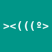

= Syntax Cheat Sheet

Everything below is live — the right-hand column is rendered by the app itself.

== Structure

[cols="2a,3a"]
|===
|Syntax |Rendered

|` = One`  / `== Two` / `=== Three` (up to 6 `=`, space after) |One
Two — headings set page structure

|`// comment` |parser comment

|`---` |rule

|`<<<` |page break
|===

== Inline

[cols="2a,3a"]
|===
|Syntax |Rendered

|`*bold*`   /  `**bold**` |*bold*

|`_italic_`   /  `__italic__` |_italic_

|`` `code` `` |`code`

|`~removed~` |~removed~

|`^super^` |base^super^line

|`"smart"`  /  `'single'` |"smart"  /  'single'

|`#highlight#` |This text is #highlighted#

|`\*  \_  \`  \^  \~`  (escape a marker) |a text *with* markers:  \* \_ \` \^ \~

|`kbd:[Ctrl,Shift]` |kbd:[Ctrl,Shift]

|`btn:[OK]` |btn:[OK]

|`menu:File [Quit > Save]` |menu:File [Quit > Save]

|`footnote:[A note]` |footnote:[A note]

|`link:https://example.org[Example]` |link:https://example.org[Example]

|`xref:meeting-notes.adoc[Opens that page]` |xref:meeting-notes.adoc[Opens that page]    (also  `<<meeting-notes,Label>>`)

|`icon:star []` |icon:star []
(heart, star, check, info, warning, file, tag, search, gear)

|`` |

|`pass:[<b>raw <i>html</i></b>]` |pass:[<b>raw <i>html</i></b>]
|===

== Lists

[cols="2a,3a"]
|===
|Syntax |Rendered

|`* item`  /  `- item`   (nest with 2 spaces)
|a|* item
* item
* item

|`1. step`  /  `2. step`
|a|1. step
2. step

|`- [ ] todo`   /   `- [x] done` — tap to toggle
|a|- [ ] todo
- [x] done

|`term:: definition`   (same line or next)
|a|parser::
writes blocks.
toggle::
a tappable state, in-place.

|`<1> labeled`
|a|<1> labeled
<2> labeled
|===

== Blocks

[cols="2a,3a"]
|===
|Syntax |Rendered

|`----` fence,  `[source,lang]` line above
|a|[source,rust]
----
fn main() { /* code */ }
----

|`....` fence — whitespace kept
|a|....
     literal block
     keeps  spaces

|`____` fence,  `[quote, Author, Source]` above
|a|[quote, Example]
____
Quoted text with
attribution.
____

|`[verse, Author]` + `____` fence
|a|[verse, Poet]
____
Line one
Line two
____

|`>` consecutive lines
|a|> A one-line quote.

|`****` fence
|a|****
Sidebar block.
****

|`====` fence
|a|====
Example block.
====

|`--` fence
|a|--
Open block.
--

|`[NOTE]` / `[TIP]` / `[WARNING]`, text after
|a|[NOTE]
Admonition with colored icon.

|`|===` fence, `|` vs `a|` cells (see “Tables” below)
|a|Tables can’t be nested inside other table cells.

|`image::icon.png[Alt, width=100]`
|a|image::icon.png[Alt, width=80]
|===

== Tables

`|` cells are single-line inline text; `a|` cells are full AsciiDoc;
`[cols="1,2"]` sets proportional column widths.

[cols="1,3a"]
|===
|Inline cell
|a|*Bold* cell with `code` markup

|Lists work in `a|` cells
|a|- first
- second
|===
